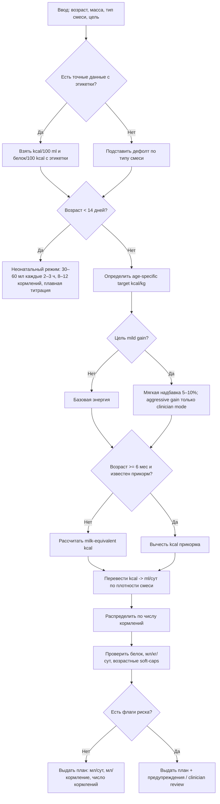

# Расчёты кормления детей до года на смесях

## Executive summary

Для приложения, которое рассчитывает кормления детей первого года жизни на адаптированных смесях, самая надёжная архитектура — не фиксированная константа вроде «150 мл/кг/сут на весь первый год», а **возраст-зависимая энергетическая модель**: сначала выбирается целевая энергия в ккал/кг/сут, затем она переводится в мл/сут через фактическую энергетическую плотность смеси, а затем распределяется по числу кормлений с учётом возраста и принципов responsive feeding. Такой подход лучше согласуется с современными requirement-based оценками ВОЗ/FAO/UNU и EFSA, чем со старыми intake-based эвристиками. Для первых дней жизни нужен отдельный неонатальный режим, а после введения прикорма — режим «milk-equivalent ceiling», потому что после 6 месяцев формула уже не обязана покрывать весь суточный калораж. citeturn9view0turn13view2turn16view0turn40view0turn23search1

Ключевое практическое расхождение источников такое: **российские нормы и часть российских учебно-методических текстов** продолжают оперировать более высокими величинами энергии для детей до года — порядка 110–115 ккал/кг/сут и белка 2,2–2,9 г/кг/сут, а также рекомендуют калорийный метод расчёта смеси 115 ккал/кг в первые 6 месяцев с ограничениями суточного объёма 850 мл в 3 месяца, 900 мл в 4 месяца и 1000 мл после 5 месяцев. Напротив, **международные TEE-based оценки** снижают целевой калораж быстрее: для formula-fed infants примерно от 120 ккал/кг в 1 месяц до около 81 ккал/кг с 7 месяца. Для приложения это означает, что российские значения полезно показывать как **локальную справочную норму и safety-check**, но базовый расчёт лучше строить на более современной age-varying requirement curve. Это инженерный вывод из сопоставления российских и международных документов. citeturn39view0turn30view0turn38search5turn13view2turn16view0

По составу смесей дефолтная логика должна исходить из того, что стандартные infant formula в ЕС/Codex имеют **60–70 ккал/100 мл** готового продукта; для смесей на белках коровьего или козьего молока белок обычно нормируется в диапазоне **1,8–2,5 г/100 ккал**. Это хорошо покрывает реальные «стандартные» разведения около **20 kcal/oz**, то есть примерно **67 ккал/100 мл**. Если пользователь не задаёт бренд или точную этикетку, разумный дефолт для расчёта — **67 ккал/100 мл**, но для специализированных смесей, гидролизатов, соевых и медицинских high-energy формул приложение должно уметь работать от конкретных label-values, а не от общих диапазонов. citeturn17view0turn17view1turn19view0turn23search7turn23search9

Наконец, алгоритм не должен автоматически усиливать питание в «режиме набора веса» так же агрессивно, как это делается в клинической нутритивной коррекции недостаточности питания. В российских клинических материалах повышенные цели 120–160 ккал/кг/сут и выше относятся к отдельным состояниям — ЗВУР, недостаточность питания, хроническая патология — и не должны становиться «обычным» пользовательским режимом без медицинского сопровождения. Для массового приложения безопаснее ограничить обычный режим gain-mode мягкой надбавкой порядка 5–10% к возрастной цели и переводить все более агрессивные сценарии в clinician-review mode. citeturn39view1turn35view1

## Нормативная рамка и как трактовать расхождения

Если расставить источники по приоритету для продуктовой логики, то иерархия выглядит так:

- **ВОЗ / FAO / UNU** и русскоязычное руководство ВОЗ-Европа — для физиологической логики, энергетических потребностей, принципов построения национальных рекомендаций и безопасного использования заменителей грудного молока. citeturn9view0turn13view2turn27view0turn28view1turn28view3
- **ESPGHAN, EFSA, регуляторика ЕС и Codex** — для современной европейской логики требований к составу смесей, энергетическим и белковым ориентирам, а также для management-путей при аллергии и прематурности. citeturn16view0turn17view0turn19view0turn31search0turn42search6turn31search10
- **Национальная программа оптимизации вскармливания детей первого года жизни в РФ**, **МР 2.3.1.0253-21** и **ТР ТС 033/2013 / приложение 1** — для русскоязычной клинической и регуляторной практики в России/ЕАЭС. citeturn39view0turn30view0turn38search5turn21view1
- **Оригинальные исследования** — для валидации инженерных допущений о потребностях, объёмах и белке: Butte по TEE, Fomon по объёмам ad libitum, Räihä по 1,8 г белка/100 ккал, Koletzko/Inostroza/Weber/Kouwenhoven по влиянию белка formula на рост и риск избыточной массы. citeturn9view0turn8view5turn33search0turn32search0turn43search11turn43search2turn43search18turn43search12turn43search9

Самое важное расхождение — между **международным requirement-based подходом** и **российскими физиологическими нормами/клиническими методичками**. ВОЗ/FAO/UNU и EFSA опираются на total energy expenditure плюс энергию роста, рассчитанные по данным doubly labeled water и WHO growth standards. В этих системах потребность в энергии на кг быстро падает в первые месяцы жизни и далее стабилизируется. Российские нормы 2021 года по-прежнему формулируют потребность детей до года как 110–115 ккал/кг, а белок — 2,2–2,9 г/кг; Национальная программа РФ также прямо рекомендует при искусственном вскармливании считать объём смеси до 6 месяцев из 115 ккал/кг с верхними ограничениями суточного объёма. Для продуктовой логики это означает, что **международная кривая лучше подходит как «двигатель» расчёта**, а российские нормы — как «локальный режим отображения» и как дополнительные review-thresholds. citeturn13view2turn16view0turn30view0turn38search5turn39view0

Ещё одно практическое следствие для UX: приложение **не должно принудительно переводить** ребёнка на follow-on formula только потому, что возраст превысил 6 месяцев. NHS прямо указывает, что first infant formula пригодна с рождения и может оставаться основным молочным напитком весь первый год; follow-on formula не нужна как обязательный этап и не должна использоваться до 6 месяцев. Для алгоритма расчёта это значит, что «тип смеси» нужен прежде всего для считывания **label-specific energy/protein density**, а не как жёсткая возрастная дискретизация. citeturn23search1

## Энергия, белок и состав смесей

### Возрастные ориентиры по энергии и белку

Ниже приведены таблицы, которые полезно хранить в приложении отдельно: **энергетическую кривую** — как основной вычислительный движок, и **белковые ориентиры** — как модуль проверки адекватности/избыточности, а не как самостоятельный драйвер увеличения объёма. Это важно, потому что современные данные по составу formula и по obesity programming поддерживают более низкий белок, чем старые intake-based национальные нормы. citeturn13view2turn17view0turn43search11turn43search18

| Возраст    | Целевой калораж для formula-fed infants, ккал/кг/сут | Эквивалент для смеси 67 ккал/100 мл, мл/кг/сут |
| ---------- | ---------------------------------------------------: | ---------------------------------------------: |
| 0–<1 мес   |                                                  120 |                                            179 |
| 1–<2 мес   |                                                  109 |                                            163 |
| 2–<3 мес   |                                                  100 |                                            149 |
| 3–<4 мес   |                                                   87 |                                            130 |
| 4–<5 мес   |                                                   86 |                                            128 |
| 5–<6 мес   |                                                   84 |                                            125 |
| 6–<7 мес   |                                                   81 |                                            121 |
| 7–<8 мес   |                                                   81 |                                            121 |
| 8–<9 мес   |                                                   81 |                                            121 |
| 9–<10 мес  |                                                   81 |                                            121 |
| 10–<11 мес |                                                   81 |                                            121 |
| 11–<12 мес |                                                   81 |                                            121 |

Примечание к таблице: месячные целевые значения энергии для formula-fed infants взяты из WHO/FAO/UNU Table 3.3; пересчёт в мл/кг/сут выполнен для стандартной смеси 67 ккал/100 мл, что соответствует широко используемому стандартному разведению около 20 kcal/oz и укладывается в регуляторный диапазон 60–70 ккал/100 мл. citeturn13view2turn17view0turn19view0turn23search7turn23search9

| Возраст  |                                       Международный белковый benchmark | Российская справочная норма для детей на ИВ | Практическая интерпретация для приложения                                                                  |
| -------- | ---------------------------------------------------------------------: | ------------------------------------------: | ---------------------------------------------------------------------------------------------------------- |
| 0–1 мес  |                                                 около 2,0–2,5 г/кг/сут |                                2,2 г/кг/сут | Белок в раннем неонатальном периоде выше; важнее не форсировать объём, а не допускать ошибок разведения    |
| 1–2 мес  |                                                     около 1,8 г/кг/сут |                                2,2 г/кг/сут | Стандартная formula обычно покрывает потребность при адекватном калораже                                   |
| 2–4 мес  |                                                     около 1,4 г/кг/сут |                          2,2 → 2,6 г/кг/сут | Российская норма выше; не использовать её как причину автоматического перекорма                            |
| 4–6 мес  |                                                     около 1,3 г/кг/сут |                                2,6 г/кг/сут | Современные low-protein formula здесь всё ещё считаются адекватными по росту                               |
| 6–12 мес | около 1,31 г/кг в 6 мес с переходом к 1,14 г/кг к году; DGE — 1,3 г/кг |                                2,9 г/кг/сут | После введения прикорма молочная формула покрывает только часть белка; считать нужно уже совокупный рацион |

Примечание к таблице: международные ориентиры собраны из Fomon 1991, DGE 2019, EFSA 2012 и WHO/FAO/UNU 2007; российские — из МР 2.3.1.0253-21 и Национальной программы РФ. Разница между столбцами — не ошибка, а следствие разных методологических школ. Для алгоритма белок лучше использовать как валидационный слой, а не как автоматическое основание повышать мл/сут. citeturn8view5turn8view3turn30view0turn38search5

Практически это означает следующее. Если приложение считает объём по энергии и получает на стандартной смеси суточное поступление белка, которое ближе к современным международным lower-benchmark-ам, это **не повод автоматически увеличивать объём**, если рост и прибавки нормальные. Наоборот, накопленные данные показывают, что более высокий белок в formula ускоряет набор массы в первые два года и ассоциирован с более высоким BMI и риском ожирения позже. В рандомизированных исследованиях lower-protein formula замедляла избыточный ранний набор массы и давала антропометрию, более близкую к группе грудного вскармливания, при сохранении адекватного роста. citeturn43search11turn43search16turn43search2turn43search18turn43search12

### Типовые составы и калорийность смесей

| Категория смеси                                               | Типичный возраст использования                                   |       Энергия, ккал/100 мл |                                Белок, г/100 ккал | Белок при 67 ккал/100 мл, г/100 мл | Что хранить в приложении                                 |
| ------------------------------------------------------------- | ---------------------------------------------------------------- | -------------------------: | -----------------------------------------------: | ---------------------------------: | -------------------------------------------------------- |
| Стандартная infant formula на белках коровьего/козьего молока | 0–6 мес, при желании и далее до 12 мес                           |                      60–70 |                                          1,8–2,5 |                          1,21–1,68 | Дефолт: 67 ккал/100 мл, но лучше фактическое label-value |
| Follow-on formula на белках коровьего/козьего молока          | >6 мес                                                           |                      60–70 |                                          1,6–2,5 |                          1,07–1,68 | Не делать обязательной сменой типа в 6 мес               |
| Соевая formula                                                | Только по показаниям; в ряде систем — с 6 мес под меднаблюдением |                      60–70 |                            обычно от 2,25 до 2,8 |                          1,51–1,88 | Всегда привязывать к бренду/этикетке и медпоказанию      |
| Гидролизованная formula                                       | По показаниям; не сводить к «обычной смеси от колик»             |                      60–70 | зависит от группы, примерно 1,86–2,8 или 1,9–2,8 |                          1,25–1,88 | Обязательно хранить точные label-values                  |
| Медицинские high-energy / preterm формулы                     | Вне обычного consumer-режима                                     | вне стандартного диапазона |                                  отдельные нормы |                         label-only | Выводить из обычного калькулятора в clinician mode       |

Примечание к таблице: диапазоны энергии и белка для стандартных infant/follow-on formula даны по Регламенту ЕС 2016/127 и Codex STAN 72; ЕАЭС задаёт аналогичные коридоры по белку/жирам/углеводам на 100 мл готового продукта; WHO Europe отдельно подчёркивает, что промышленные смеси должны соответствовать Codex standards. Для соевых смесей NHS рекомендует использовать их только под медицинским наблюдением и, как правило, с 6 месяцев. citeturn17view0turn17view1turn17view3turn17view4turn17view5turn18view1turn19view0turn21view1turn28view1turn42search7

Из этого для data model следуют два решения. Во-первых, смесь в БД должна храниться **как минимум двумя нормализованными способами одновременно**: `kcal_per_100ml_ready`, `protein_g_per_100kcal`, а также, по возможности, `protein_g_per_100ml_ready`. Во-вторых, приложение должно явно различать **consumer-standard formula** и **special medical formula**. Для второй группы нельзя использовать «средние» значения 67 ккал/100 мл и нельзя применять массовые ограничения без врача. citeturn17view0turn19view0turn31search10turn42search6

## Расчёт объёма и частоты кормлений

### Формулы расчёта

Базовая формула должна быть энергетической:

```text
kcal_per_ml = kcal_per_100ml / 100
daily_kcal_target = weight_kg * target_kcal_per_kg(age)
daily_formula_ml = daily_kcal_target / kcal_per_ml
```

Если доступна оценка калорий из прикорма, после 6 месяцев лучше использовать residual-mode:

```text
daily_formula_kcal = max(0, daily_kcal_target - solids_kcal_day)
daily_formula_ml = daily_formula_kcal / kcal_per_ml
```

Отдельно нужно проверять белок:

```text
protein_g_day = daily_kcal_from_formula * protein_g_per_100kcal / 100
protein_g_kg_day = protein_g_day / weight_kg
```

Именно в таком порядке. Сначала энергия, потом объём, потом белок как audit-layer. Это напрямую согласуется с TEE-based логикой ВОЗ/FAO/UNU, с EFSA для 7–11 месяцев и с регуляторной логикой состава formula в ЕС/Codex. citeturn9view0turn13view2turn16view0turn17view0turn19view0

Практические sanity-check формулы полезны, но они должны быть вторичными:

| Метод                       | Формула                                                | Когда полезен                              | Ограничение                                                         |
| --------------------------- | ------------------------------------------------------ | ------------------------------------------ | ------------------------------------------------------------------- |
| Энергетический              | `wt × age-specific kcal/kg ÷ kcal/ml`                  | Главный расчёт                             | Требует возрастной кривой и плотности смеси                         |
| Residual после прикорма     | `(wt × kcal/kg - solids_kcal) ÷ kcal/ml`               | После 6 мес, если приложение умеет прикорм | Без учёта прикорма завышает роль milk feeds                         |
| UK/NHS эвристика            | ~150–200 мл/кг/сут после конца первой недели до ~6 мес | Быстрая проверка для первых месяцев        | Слишком грубая для всего первого года                               |
| Российская калорийная схема | 115 ккал/кг в первые 6 мес; soft-caps 850/900/1000 мл  | Локальный режим РФ / review thresholds     | Может завышать цель после 3–4 мес по сравнению с TEE-based оценками |

Примечание к таблице: UK/NHS guide указывает, что к концу первой недели большинству младенцев требуется около 150–200 мл/кг/сут до примерно 6 месяцев; Национальная программа РФ рекомендует 115 ккал/кг в первые 6 месяцев и ограничивает суточный объём 850 мл в 3 месяца, 900 мл в 4 месяца и 1000 мл после 5 месяцев. citeturn34search2turn34search8turn39view0

В инженерной реализации это удобно свести к трём уровням проверки. **Первый уровень** — расчёт от энергии. **Второй уровень** — сопоставление результата с возрастным коридором мл/кг/сут и с локальными soft-caps. **Третий уровень** — клиническая логика: достаточны ли прибавки массы, нет ли признаков недокорма/перекорма, совпадает ли тип formula с возрастом и показаниями. Такая архитектура лучше, чем hard-coded таблица «мл на одно кормление по возрасту», потому что масса тела у детей одного возраста сильно различается, а современные потребности формируются от веса и расхода энергии, а не только от даты рождения. citeturn13view2turn30view0turn39view0

Ниже — график для стандартной смеси 67 ккал/100 мл. Он показывает **рассчитанный суточный объём** для детей с массой 4, 6, 8 и 9 кг при использовании возрастной formula-fed energy curve WHO/FAO/UNU. Это хороший материал для UI: пользователю можно показывать не одну точку, а «позицию ребёнка» на прогнозной кривой. citeturn13view2turn17view0turn23search9


### Частота кормлений по возрасту

| Возраст                | Типичная частота молочных кормлений                  | Практическая логика для приложения                                                                   |
| ---------------------- | ---------------------------------------------------- | ---------------------------------------------------------------------------------------------------- |
| Первые дни жизни       | 8–12 раз/сут                                         | Стартовать с 30–60 мл за кормление каждые 2–3 часа, затем быстро титровать по голоду и весу          |
| Первые недели и месяцы | Обычно каждые 3–4 часа                               | Для расписания по умолчанию считать 6–8 кормлений/сут, но не ломать responsive feeding               |
| 2–4 месяца             | Обычно 5–6 кормлений/сут                             | Перекладывать рост объёма в `ml/feed`, а не в более частые кормления                                 |
| 4–6 месяцев            | Обычно около 5 кормлений/сут                         | Держать режим стабильным, не использовать кормление как единственный способ успокаивания             |
| 6–12 месяцев           | Обычно 5–6 feed-occasions formula или solids в сутки | При наличии прикорма считать уже комбинированные «молочные + пищевые» эпизоды и снижать роль formula |

Примечание к таблице: CDC рекомендует в первые дни предлагать 1–2 oz каждые 2–3 часа, отмечает 8–12 кормлений у formula-fed newborns в сутки, далее — удлинение интервалов до примерно 3–4 часов; в 6–12 месяцев большинству детей требуется formula или solids около 5–6 раз в сутки. NHS также подчёркивает, что first infant formula может использоваться весь первый год, а дети в итоге кормятся «little and often», без жёсткой обязанности допивать бутылочку. citeturn40view0turn23search1turn34search3

Для UI это лучше представить не как одно число, а как **рекомендуемый диапазон feed_count** и **расчётный диапазон мл/кормление**. Например, если суточный объём посчитан как 840 мл/сут для ребёнка 4 месяцев, приложение должно показывать не «ровно 168 мл × 5», а что-то вроде «около 140–170 мл за кормление при 5–6 кормлениях/сут, ориентируясь на сигналы голода и насыщения». CDC прямо указывает, что младенцы обычно берут именно тот объём, который им нужен, и прекращают есть, когда насытились. citeturn40view0

## Алгоритм для приложения

Главная продуктовая развилка должна быть такой. До 14 дней нельзя использовать только month-based curve: нужен стартовый newborn logic. С 14 дней до 6 месяцев — основной режим `exclusive_formula_assumption`. После 6 месяцев — тот же режим остаётся как **milk-equivalent ceiling**, но если приложение умеет учитывать калории прикорма, то нужно автоматически переключаться на `residual_after_solids`. Специальные формулы, prematurity, низкая масса при рождении, catch-up nutrition и CMPA должны переводить пользователя в расширенный режим с более жёсткими предупреждениями. Такой дизайн согласуется с CDC, российской Национальной программой, EFSA/WHO-TEE logic и ESPGHAN guidance по отдельным патологическим сценариям. citeturn40view0turn39view0turn16view0turn31search10turn42search6

### Псевдокод

```python
def calculate_formula_plan(
    age_days: int,
    weight_kg: float,
    formula_type: str,
    kcal_per_100ml: float | None = None,
    protein_g_per_100kcal: float | None = None,
    goal: str = "maintain",             # maintain | mild_gain
    solids_kcal_day: float | None = None,   # optional, strongly recommended after 6 months
    clinician_mode: bool = False
):
    # --- validation ---
    assert 0 <= age_days <= 365
    assert 1.5 <= weight_kg <= 15.0

    # --- defaults by formula type ---
    defaults = {
        "standard":   {"kcal_per_100ml": 67, "protein_g_per_100kcal": 1.8},
        "follow_on":  {"kcal_per_100ml": 67, "protein_g_per_100kcal": 1.6},
        "soy":        {"kcal_per_100ml": 67, "protein_g_per_100kcal": 2.25},
        "hydrolysate":{"kcal_per_100ml": 67, "protein_g_per_100kcal": 1.9},
    }

    if formula_type in ["preterm", "high_energy", "amino_acid", "medical"]:
        return warning("Use label-specific clinician mode only")

    if kcal_per_100ml is None:
        kcal_per_100ml = defaults[formula_type]["kcal_per_100ml"]
    if protein_g_per_100kcal is None:
        protein_g_per_100kcal = defaults[formula_type]["protein_g_per_100kcal"]

    kcal_per_ml = kcal_per_100ml / 100.0

    # --- neonatal handling ---
    if age_days < 14:
        # formula-fed newborn: 1–2 oz (30–60 ml) every 2–3 h initially
        feed_count_range = (8, 12)
        base_daily_ml = clamp(weight_kg * 180, lower=weight_kg * 150, upper=weight_kg * 200)
        # smooth ramp in first 2 weeks
        daily_ml = interpolate_by_day(age_days, day0=300, day14=base_daily_ml)
        per_feed_range = (
            round_to_5ml(daily_ml / feed_count_range[1]),
            round_to_5ml(daily_ml / feed_count_range[0]),
        )
        return package_result(...)

    # --- age-specific energy target from formula-fed requirement curve ---
    # month nodes for 0-<1, 1-<2, ... 11-<12 months
    month_nodes = [0, 1, 2, 3, 4, 5, 6, 7, 8, 9, 10, 11]
    kcalkg_nodes = [120, 109, 100, 87, 86, 84, 81, 81, 81, 81, 81, 81]

    age_months = age_days / 30.4375
    target_kcal_kg = linear_interpolate(age_months, month_nodes, kcalkg_nodes)

    # --- goal adjustment ---
    if goal == "mild_gain":
        if clinician_mode:
            target_kcal_kg *= 1.10
        else:
            target_kcal_kg = min(target_kcal_kg * 1.05, target_kcal_kg + 5)

    total_kcal_target = weight_kg * target_kcal_kg

    # --- after solids ---
    milk_equivalent_kcal = total_kcal_target
    if solids_kcal_day is not None and age_days >= 180:
        milk_equivalent_kcal = max(0, total_kcal_target - solids_kcal_day)

    daily_ml = milk_equivalent_kcal / kcal_per_ml

    # --- feeding frequency ---
    feed_count = recommend_feed_count(age_days)
    # e.g. 14-60 d: 6-8; 61-120 d: 5-6; 121-180 d: ~5; 181-365 d: 4-5 milk feeds

    ml_per_feed = daily_ml / feed_count

    # --- protein audit ---
    protein_g_day = milk_equivalent_kcal * protein_g_per_100kcal / 100.0
    protein_g_kg_day = protein_g_day / weight_kg

    # --- warnings / soft caps ---
    flags = []
    if age_days >= 90 and age_days < 120 and daily_ml > 850:
        flags.append("Above Russian soft cap for 3 months")
    if age_days >= 120 and age_days < 150 and daily_ml > 900:
        flags.append("Above Russian soft cap for 4 months")
    if age_days >= 150 and daily_ml > 1000:
        flags.append("Above Russian soft cap after 5 months")
    if age_days >= 7 and daily_ml / weight_kg > 200:
        flags.append("Above broad practical upper corridor")
    if formula_type == "follow_on" and age_days < 180:
        flags.append("Follow-on formula should not be used under 6 months")
    if formula_type == "soy" and age_days < 180:
        flags.append("Soy formula: medical supervision advised / not casual switch")
    if protein_g_kg_day > 3.0 and not clinician_mode:
        flags.append("Protein delivery unusually high for routine consumer mode")

    return {
        "target_kcal_kg": round(target_kcal_kg, 1),
        "milk_equivalent_ml_day": round_to_10ml(daily_ml),
        "feed_count": feed_count,
        "ml_per_feed": round_to_5ml(ml_per_feed),
        "protein_g_day": round(protein_g_day, 1),
        "protein_g_kg_day": round(protein_g_kg_day, 2),
        "flags": flags,
    }
```

В этом псевдокоде есть два сознательных инженерных решения. Первое: **для healthy term infant не делать auto-catch-up beyond mild_gain**, потому что российские цели 120–160 ккал/кг/сут и белок 3–4,5 г/кг/сут относятся уже к клинической коррекции недостаточности питания. Второе: **после 6 месяцев без ввода прикорма показывать “milk-equivalent ceiling”, а не жёсткое “ребёнок должен выпить столько-то”**. Это помогает не программировать перекорм в возраст, когда часть энергии уже должна приходить из complementary foods. citeturn39view1turn40view0turn23search1

### Mermaid-диаграмма алгоритма



## Кейсы и валидация

### Примеры расчётов

Во всех примерах ниже, если не указано иное, используется **стандартная смесь 67 ккал/100 мл** и белок **1,8 г/100 ккал**. Это не бренд, а инженерный дефолт для mature consumer formula. citeturn17view0turn19view0turn23search9

| Кейс                | Исходные данные                                     | Логика                                                                | Результат                                                                                  |
| ------------------- | --------------------------------------------------- | --------------------------------------------------------------------- | ------------------------------------------------------------------------------------------ |
| Новорождённый       | 10 дней, 3,6 кг, стандартная смесь, поддержание     | Неонатальный режим + ориентир 150–200 мл/кг/сут к концу первой недели | Около **645 мл/сут**, обычно **8–10 кормлений**, то есть примерно **65–80 мл/кормление**   |
| Ребёнок 2 месяцев   | 2 мес, 5,0 кг, стандартная смесь, поддержание       | 109 ккал/кг/сут                                                       | Около **813 мл/сут**, **6–7 кормлений**, примерно **115–135 мл/кормление**                 |
| Ребёнок 4 месяцев   | 4 мес, 6,5 кг, стандартная смесь, поддержание       | 87 ккал/кг/сут                                                        | Около **844 мл/сут**, **5–6 кормлений**, примерно **140–170 мл/кормление**                 |
| Лёгкий режим набора | 3 мес, 4,8 кг, standard, mild gain +10%             | 100 ккал/кг → 110 ккал/кг                                             | Около **788 мл/сут**, **7 кормлений**, примерно **110–115 мл/кормление**                   |
| После прикорма      | 8 мес, 8,2 кг, standard, при прикорме ~250 ккал/сут | Полный milk-equivalent ≈ 991 мл/сут; residual-mode после прикорма     | **Около 618 мл/сут formula**, обычно **4–5 milk feeds**, примерно **120–155 мл/кормление** |

Примечание к таблице: для case 5 показаны оба смысловых режима. Если приложение **не знает**, сколько ребёнок получает из прикорма, ему лучше показать **milk-equivalent ceiling**; если знает — считать residual. Это особенно важно после 6 месяцев, потому что CDC прямо пишет, что в 6–12 месяцев ребёнку обычно нужны formula или solids около 5–6 раз в сутки, а по мере роста объёма прикорма потребность в formula уменьшается. citeturn40view0turn23search1

Что видно из кейсов. Во-первых, объём в мл/сут у детей одного возраста зависит от массы настолько сильно, что простая таблица «по возрасту» без веса в приложении недостаточна. Во-вторых, mild gain-mode должен быть действительно **мягким**: даже +10% быстро поднимает белок и общий объём. В-третьих, после 6 месяцев без учёта прикорма пользователь почти всегда увидит объём formula выше того, что ребёнок реально выпивает как молочную часть рациона; именно поэтому optional-input `solids_kcal_day` — не роскошь, а очень полезное улучшение модели. citeturn13view2turn39view1turn40view0

### Рекомендации по валидации алгоритма

Валидацию лучше строить в трёх слоях: against-guideline, against-regulation и against-growth-logic. Российская Национальная программа включает WHO Child Growth Standards и WHO Growth Velocity Standards в приложениях; это хороший мост между клиническим контекстом и инженерным тестированием. citeturn30view0

| Семейство тестов   | Что варьировать                                                                            | Что должно проверяться                                                                        |
| ------------------ | ------------------------------------------------------------------------------------------ | --------------------------------------------------------------------------------------------- |
| Референсная сетка  | Возраст 0, 7, 14, 30, 60, 90, 120, 180, 240, 330 дней; масса по WHO −1 SD / median / +1 SD | Нет отрицательных или физиологически абсурдных объёмов; плавность переходов между интервалами |
| Плотность смеси    | 60, 67, 70 ккал/100 мл                                                                     | При одной и той же цели по ккал/сут более калорийная смесь даёт меньший мл/сут                |
| Белок смеси        | 1,8; 2,0; 2,5 г/100 ккал; отдельные наборы для soy/hydrolysate                             | Корректный audit белка/кг; предупреждение при чрезмерной белковой нагрузке                    |
| Newborn edge cases | 1, 3, 7, 10, 14 дни                                                                        | Не происходит скачка от day-based режима к month-based                                        |
| Локальный режим РФ | 3, 4, 5 месяцев с крупной массой                                                           | Срабатывают soft-caps 850/900/1000 мл, но расчёт не ломается                                  |
| After-solids mode  | 6, 8, 10, 11 месяцев; solids 100–400 ккал/сут                                              | Формула уменьшается только на kcal прикорма, а не по произвольному возрастному коэффициенту   |
| Невалидные входы   | Возраст >365 дней, масса <1,5 кг, kcal density <50 или >100 без clinician mode             | Понятные ошибки ввода                                                                         |

Для regression-tests полезно зафиксировать 20–30 «золотых» сценариев и требовать от движка стабильности до округления ±5 мл/кормление и ±10 мл/сут. Для визуальной QA стоит дополнительно строить heatmap по сетке `age × weight`, чтобы находить артефакты после обновлений: например, нелепые пики в 3–4 месяца, discontinuity в 14 дней или слишком резкое снижение после 180 дней. Источником референтных возрастных энергий здесь должны оставаться те же таблицы WHO/FAO/UNU и EFSA, а источником антропометрической осмысленности — WHO growth standards. citeturn13view2turn16view0turn30view0

## Клинические предупреждения и ключевые источники

### Клинические предупреждения и противопоказания для обычного калькулятора

**Недокорм и обезвоживание** нельзя оценивать только по расчётному мл/сут. NHS указывает, что достаточность formula feeding подтверждается прибавкой массы и числом мокрых подгузников; после первых дней жизни ориентиром обычно служат около 6 мокрых подгузников в сутки с прозрачной или бледно-жёлтой мочой. WHO Europe отдельно предупреждает, что слишком густое разведение formula перегружает ребёнка солями и белком, а значит приложение должно выводить заметное предупреждение: **никогда не менять концентрацию порошка относительно инструкции без медназначения**. citeturn34search3turn28view1

**Подозрение на аллергию к белкам коровьего молока** — это не задача объёмного калькулятора. ESPGHAN рассматривает CMPA как отдельный диагностико-лечебный путь с элиминацией аллергена и отдельным выбором formula. Не следует автоматически советовать soy formula как бытовую замену; NHS пишет, что соевая смесь подходит, как правило, только с 6 месяцев и под медицинским наблюдением. Приложение должно показывать red flag при сочетании formula feeding с такими маркерами, как кровь в стуле, немедленные реакции, выраженная экзема, повторная рвота после кормлений или отсутствие эффекта от обычной смены formula volume. citeturn42search6turn42search7

**Недоношенность, низкая масса при рождении, ЗВУР, хроническая сердечная/лёгочная/неврологическая патология, специальные high-energy formula и preterm formula** должны выводиться из consumer-mode. По российским клиническим материалам и по ESPGHAN для preterm infants в этих группах действуют отдельные цели по энергии и белку, которые могут существенно отличаться от здоровых доношенных детей первого года жизни. citeturn39view1turn31search10

**Риск перекорма** тоже реален. CDC советует ориентироваться на сигналы голода и насыщения, а российская Национальная программа отдельно предупреждает не использовать кормление как единственное средство успокоения ребёнка, особенно после 2–3 месяцев, потому что это повышает потребление пищи и риск избыточной массы тела. Для product logic это значит, что приложение должно выдавать не команду «ребёнок должен допить X мл», а диапазон и подпись вроде «если ребёнок отворачивается, засыпает или перестаёт сосать активно — кормление можно завершать». citeturn40view0turn39view3

### Ключевые официальные и первичные источники

Наиболее полезные **официальные** документы для вашего приложения — это:

- **WHO/FAO/UNU, Human Energy Requirements**, глава по infants: даёт TEE-based вывод целевых энергопотребностей и monthly tables, включая отдельные оценки для formula-fed infants. citeturn9view0turn12view1turn13view2
- **WHO Europe, “Кормление и питание грудных детей и детей раннего возраста”**: русскоязычное руководство, полезное для общей рамки, безопасного приготовления formula и для понимания роли национальных рекомендаций. citeturn27view0turn28view1turn28view3
- **EFSA Dietary Reference Values for Energy**: особенно важен блок 7–11 месяцев. citeturn15view2turn16view0
- **Commission Delegated Regulation (EU) 2016/127** и **Codex STAN 72**: главные документы по допустимой энергии и белку в infant/follow-on formula. citeturn17view0turn17view1turn19view0
- **Национальная программа оптимизации вскармливания детей первого года жизни в РФ** и **МР 2.3.1.0253-21**: основа для русскоязычного локального режима и для сравнительного экрана «международные vs российские нормы». citeturn39view0turn30view0turn38search5
- **ТР ТС 033/2013, приложение 1**: полезен для хранения допустимых composition ranges в ЕАЭС. citeturn21view1
- **CDC** и **NHS**: лучшие публичные практические страницы для first days, частоты кормлений, bottle-feeding routines и перехода после 6 месяцев. citeturn40view0turn34search2turn34search8turn23search1

Из **первичных научных работ** я бы включил в reference pack приложения как минимум:

- **Butte** — источники по оценке TEE и energy requirements infants. citeturn9view0turn7search8
- **Fomon et al.** — данные по объёмам milk/formula ad libitum и ранней саморегуляции intake. citeturn33search0turn33search3
- **Fomon 1991** — обзор оценки protein requirements during infancy. citeturn8view5
- **Räihä et al., 2002** — безопасность и адекватность formula с 1,8 г белка/100 ккал у term infants. citeturn32search0turn32search1
- **Koletzko et al., 2009** и **Weber et al., 2014** — связь higher protein formula с более высоким весом/BMI и поздним риском ожирения. citeturn43search11turn43search16turn43search18
- **Inostroza et al., 2014** и **Kouwenhoven et al., 2020/2021** — lower-protein formula, скорость набора массы и подтверждение адекватного роста. citeturn43search2turn43search12turn43search9

Если переводить всю работу в продуктовую формулу одной фразой, то она будет такой: **для здорового доношенного ребёнка до года приложение должно считать formula-feeding через возрастную цель по энергии, реальную калорийность смеси, фактическую массу и опциональный прикорм; российские высокие нормативы и объёмные лимиты нужно не игнорировать, но трактовать как локальные review-thresholds, а не как единственный источник истины.** citeturn13view2turn39view0turn30view0turn17view0
